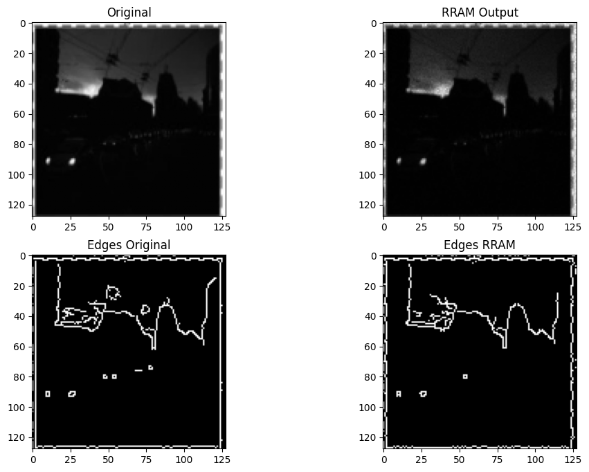
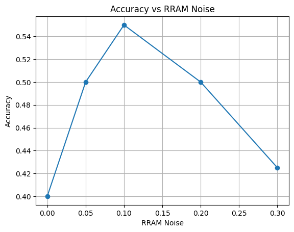
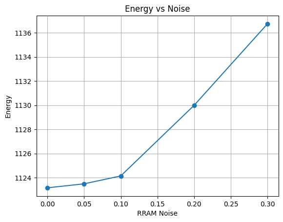
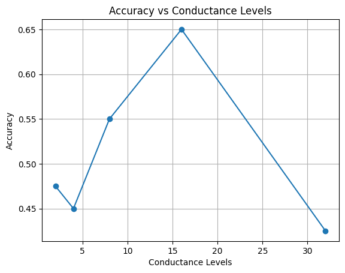

# 🧠 RRAM-In-Memory-Image-Processing

## 📌 Overview

This project presents an RRAM (Resistive Random Access Memory) based in-memory computing framework for energy-efficient image processing in neuromorphic systems. The implementation simulates RRAM device characteristics and evaluates their impact on image quality, object recognition, and energy consumption.

---

## 🎯 Research Motivation

This project investigates the application of Resistive Random Access Memory (RRAM) for in-memory image processing in neuromorphic systems. It evaluates image quality, recognition performance, and energy efficiency under different RRAM noise and conductance conditions, demonstrating the potential of RRAM-based computing for next-generation AI hardware.

---

## ✨ Features

* RRAM-based image processing simulation
* Image enhancement using conductance modeling
* Edge detection comparison
* Object recognition using MobileNetV2
* PSNR and SSIM performance evaluation
* Accuracy vs RRAM Noise analysis
* Energy Consumption analysis
* Conductance Level analysis

---

## 🛠️ Technology Stack

* Python
* TensorFlow
* MobileNetV2
* OpenCV
* NumPy
* Matplotlib
* Scikit-image
* Scikit-learn

---

## 📂 Project Workflow

1. Load Image
2. Apply RRAM Conductance Model
3. Generate Processed Image
4. Perform Edge Detection
5. Calculate PSNR & SSIM
6. Object Recognition using MobileNetV2
7. Analyze Accuracy and Energy Consumption

---

## 📊 Evaluation Metrics

* Peak Signal-to-Noise Ratio (PSNR)
* Structural Similarity Index (SSIM)
* Image Classification Accuracy
* Energy Consumption
* Conductance Analysis

---

## 📸 Project Results

### Original vs RRAM Output



### Accuracy vs RRAM Noise



### Energy vs Noise



### Accuracy vs Conductance Levels



---

## 📁 Project Structure

```text
RRAM-In-Memory-Image-Processing/
│── README.md
│── requirements.txt
│── rram_image_processing.py
│── LICENSE
│── original vs output.png
│── accuracy vs rram noise.png
│── energy vs noise.png
│── accuracy vs conductance.png
```

---

## ▶️ How to Run

### 1. Clone the repository

```bash
git clone https://github.com/chatterjeeapurba60-hash/RRAM-In-Memory-Image-Processing.git
```

### 2. Navigate to the project directory

```bash
cd RRAM-In-Memory-Image-Processing
```

### 3. Install the required libraries

```bash
pip install -r requirements.txt
```

### 4. Run the project

```bash
python rram_image_processing.py
```

---

## 🚀 Future Improvements

* FPGA implementation
* Hardware-level RRAM modeling
* Real-time image processing
* Neuromorphic accelerator integration
* Integration with emerging AI accelerators
* Evaluation on larger benchmark datasets

---

## 📄 License

This project is licensed under the MIT License. See the LICENSE file for details.

---

## 👨‍💻 Author

**Apurba Chatterjee**

B.Tech in Electronics & Communication Engineering

University of Engineering & Management (UEM), Kolkata

GitHub: https://github.com/chatterjeeapurba60-hash

---

## ⭐ Support

If you found this project useful, please consider giving it a ⭐ on GitHub. Your support helps improve the project and encourages further research and development.
